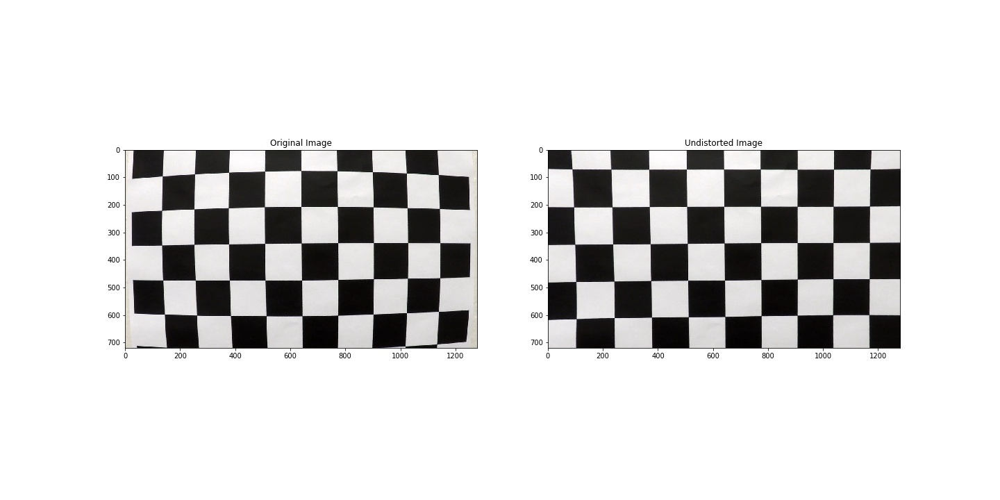
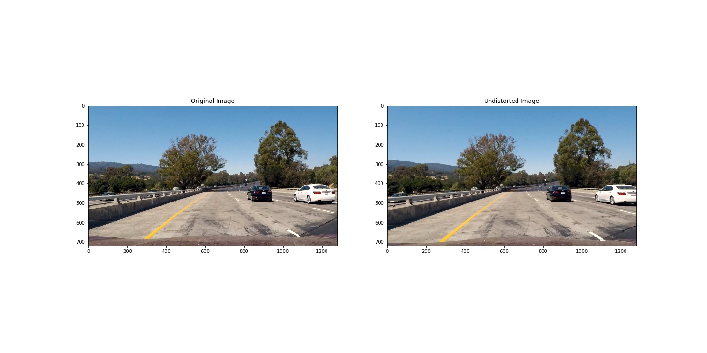
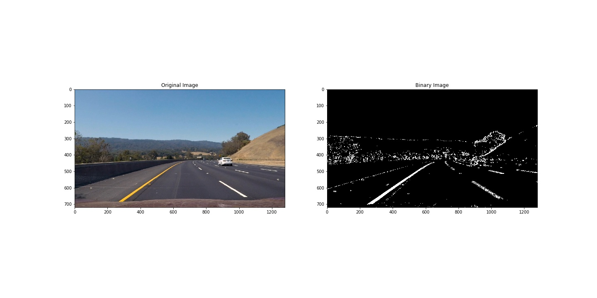
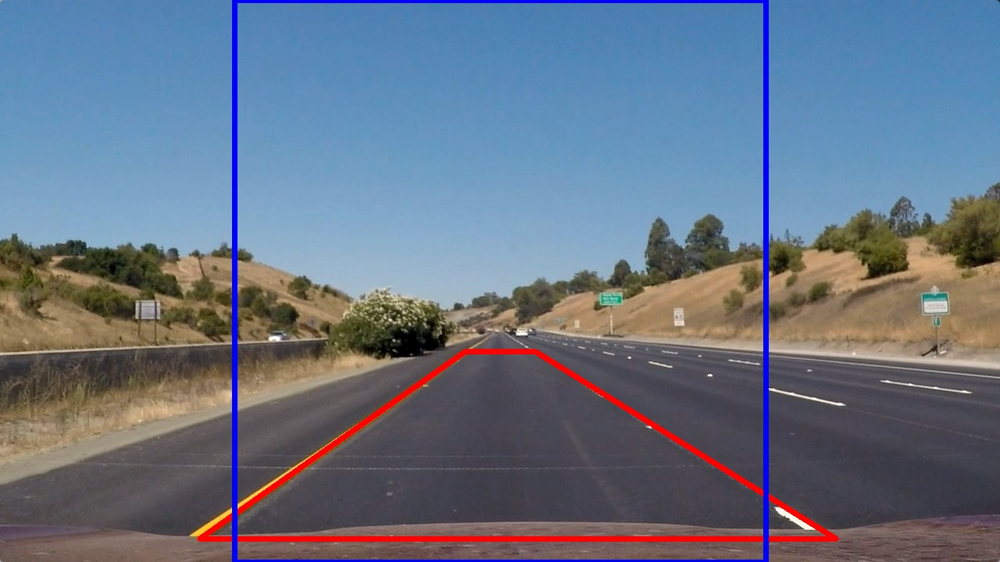
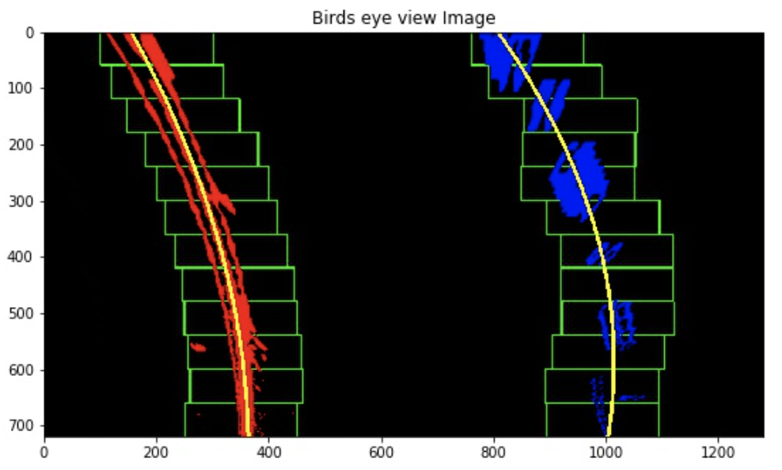
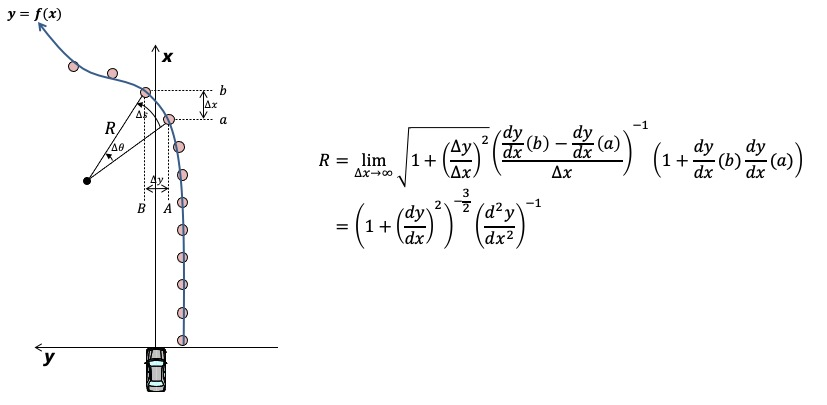
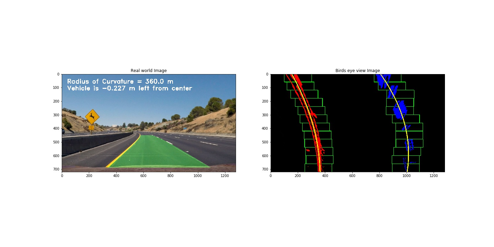
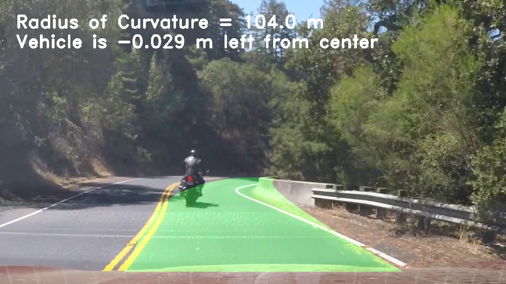
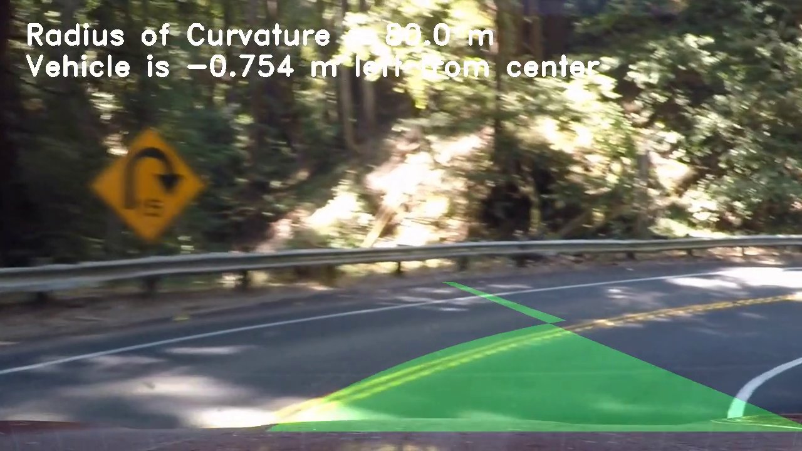
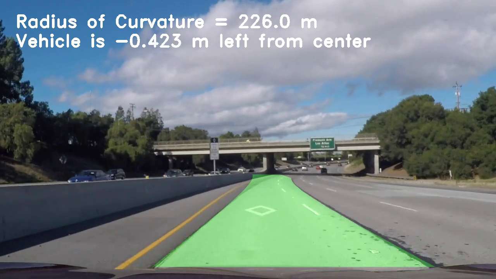

**Advanced Lane Finding Project**

The goals / steps of this project are the following:

* Compute the camera calibration matrix and distortion coefficients given a set of chessboard images.
* Apply a distortion correction to raw images.
* Use color transforms, gradients, etc., to create a thresholded binary image.
* Apply a perspective transform to rectify binary image ("birds-eye view").
* Detect lane pixels and fit to find the lane boundary.
* Determine the curvature of the lane and vehicle position with respect to center.
* Warp the detected lane boundaries back onto the original image.
* Output visual display of the lane boundaries and numerical estimation of lane curvature and vehicle position.

[//]: # (Image References)

[image1]: ./examples/undistort_output.png "Undistorted"
[image2]: ./test_images/test1.jpg "Road Transformed"
[image3]: ./examples/binary_combo_example.jpg "Binary Example"
[image4]: ./examples/warped_straight_lines.jpg "Warp Example"
[image5]: ./examples/color_fit_lines.jpg "Fit Visual"
[image6]: ./examples/example_output.jpg "Output"
[video1]: ./project_video.mp4 "Video"

## [Rubric](https://review.udacity.com/#!/rubrics/571/view) Points

### Here I will consider the rubric points individually and describe how I addressed each point in my implementation.  

---

### Camera Calibration

#### 1. Briefly state how you computed the camera matrix and distortion coefficients. Provide an example of a distortion corrected calibration image.

My camera calibration process consisted of 4 steps. Each step is as follows.

>1) Read all chessboard image (20 images)<br/>
>2) Recognize chessboard corners using OpenCV findChessboardCorners function<br/>
>3) Calculate calibration & distortion coefficients using OpenCV calibrateCamera function<br/>
>4) Apply undistortion using OpenCV undistort function <br/>

Here I am assuming the chessboard is fixed on the (x, y) plane at z=0, such that the object points are the same for each calibration image.  Thus, `objp` is just a replicated array of coordinates, and `objpoints` will be appended with a copy of it every time I successfully detect chessboard corners in a test image excepting for `calibration1.jpg`, `calibration4.jpg` and `calibration5.jpg`.

I tried to apply this distortion correction to those failed test images using the `cv2.undistort()` function and obtained this result: 

<div style="text-align:center"><br/>
<br/>
<br/>
<br/>
distorted chessboard images<br/><br/>
</div>

Finally I could confirm the cameracalibration is done properly from those results.
<br/><br/>


### Pipeline (single images)

#### 1. Provide an example of a distortion-corrected image.
To demonstrate this step, I will describe how I apply the distortion correction to one of the test images like this one:

<div style="text-align:center"><br/>
<br/>
distorted single image<br/><br/>
</div>

I used same camera calibration & distortion coefficients calculated in previous chapter.
<br/><br/>

#### 2. Describe how (and identify where in your code) you used color transforms, gradients or other methods to create a thresholded binary image.  Provide an example of a binary image result.

My binary image creation process consisted of 3 steps. Each step is as follows.

>1) Read all camera image (8 images)<br/>
>2) Apply undistortion using OpenCV undist function<br/>
>3) Smooth the image using gaussian filter to reduce noise (kernel size = 5)<br/>
>4) Create binary image from combination of color & gradient threshold<br/>

I additionally used gaussian filter to smooth the image and reduce noise (kernel size = 5). Here's an example of my output for this step.  (note: this is not actually from one of the test images)

<div style="text-align:center"><br/>
<br/>
combined binary image<br/><br/>
</div>
<br/>

#### 3. Describe how (and identify where in your code) you performed a perspective transform and provide an example of a transformed image.

My perspective transform process consisted of 3 steps. Each step is as follows.

>1) Read straight line image to find best source & destination points<br/>
>2) Calculate perspective transform matrix using OpenCV getPerspectiveTransform function (inverse matrix as well)<br/>
>3) Apply perspective transform using OpenCV calibrateCamera function<br/>

```python
src = np.array([(255, 690), (595, 450), (685, 450),(1070, 690)], dtype=np.int32)
dst = np.array([(300, 720), (300, 0), (980, 0),(980, 720)], dtype=np.int32)
```

This resulted in the following source and destination points:

| Source        | Destination   | 
|:-------------:|:-------------:| 
| 255, 690      | 300, 720      | 
| 595, 450      | 300, 0        |
| 685, 450      | 980, 0        |
| 1070, 690     | 980, 720      |

<div style="text-align:center"><br/>
<br/>
source & destination points<br/><br/>
</div>

I verified that my perspective transform was working as expected by drawing the `src` and `dst` points onto a test image and its warped counterpart to verify that the lines appear parallel in the warped image.

<div style="text-align:center"><br/>
<br/>
original image & projected image with source & destination points<br/><br/>
</div>

#### 4. Describe how (and identify where in your code) you identified lane-line pixels and fit their positions with a polynomial?

Then I did some other stuff and fit my lane lines with a 2nd order polynomial kinda like this:

<div style="text-align:center"><br/>
<br/>
original image & projected image with polynominal approximation<br/><br/>
</div>

#### 5. Describe how (and identify where in your code) you calculated the radius of curvature of the lane and the position of the vehicle with respect to center.
<br/>
First I used the equation which is derived from the derivative of polynominal to calculate left&right line curvature. After calculating each line curvature I simply get the average of the two.

<div style="text-align:center"><br/>
<br/>
curvature calculation<br/><br/>
</div>

```python
left_curverad = 
((1 + (2*left_fit[0]*y_eval*ym_per_pix + left_fit[1])**2)**(3/2))/np.abs(2*left_fit[0])
right_curverad = 
((1 + (2*right_fit[0]*y_eval*ym_per_pix + right_fit[1])**2)**(3/2))/np.abs(2*right_fit[0])
```


#### 6. Provide an example image of your result plotted back down onto the road such that the lane area is identified clearly.

I implemented this step in lines # through # in my code in `yet_another_file.py` in the function `map_lane()`.  Here is an example of my result on a test image:

<div style="text-align:center"><br/>
<br/>
original image & projected image with polynominal approximation<br/><br/>
</div>
---

### Pipeline (video)

#### 1. Provide a link to your final video output.  Your pipeline should perform reasonably well on the entire project video (wobbly lines are ok but no catastrophic failures that would cause the car to drive off the road!).

My video pipeline consisted of 3 steps. Each step is as follows.

>1) Prepare Line() Class to be able to keep the recognition result in previous step<br/>
-> I also prepared Ring_buffer() Class easily to handle those information.
>2) Call image_processing function which include every necessary processing for each image<br/>
>3) Check new measurement reliability by having some error condition(difference of curvature/ego offset/lane width)<br/>

Here's a [link to my video result](./output_video/project_video_output.mp4)

---

### Discussion

#### 1. Briefly discuss any problems / issues you faced in your implementation of this project.  Where will your pipeline likely fail?  What could you do to make it more robust?

The issue I faced is as follows.

>1) Assuming the plane is fixed at z=0 <br>
>-> We used the assumption in camera calibration & distortion. So we cannot evaluate the shape of lane line against the sloope road for example. <br>
>< countermeasure > considering z coordinate changing<br>
><div style="text-align:center">
>
></div>
>2) Limitation of Static trapezoid masking<br>
>-> We faced the issue that the line is NOT detected in steep curve situation. Below picture is an example of this issue.<br>
> < countermeasure > considering dynamic masking in stead of current static mask <br>

><div style="text-align:center">
>
></div>
>3) Limitation of Static trapezoid masking<br>
>-> we cannot distinguish the edges such as road repairing mark/tire mark from lane line. Below picture is an example of this issue. <br>
>< countermeasure > considering the relation of the next lane recognition result and surrounding object behavior  <br>

><div style="text-align:center">
>
></div>
<br>